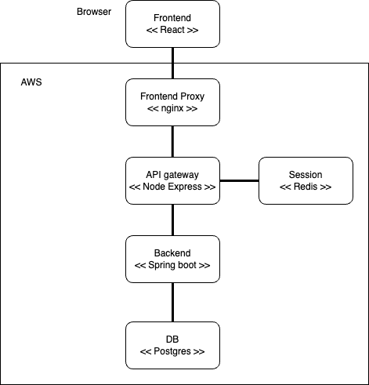

# Vekkuli

[](https://api.reuse.software/info/github.com/espoon-voltti/vekkuli)

A tool for tracking the monitoring and guidance cases related to compulsory education.

## Technical overview

The application consists of
- Frontend (React, TypeScript)
  - Citizen UI
  - nginx for proxying requests to API-Gateway and Service
- API-Gateway (Node.js, TypeScript, Express)
  - handles AD SAML authentication and stores the session in a cookie and in redis
  - proxies other API requests to the service, passing the valid user session as a signed JWT token
- Service (Spring Boot, Kotlin)
  - implements the business logic and persists the data in a Postgresql database




## Local environment and development

### Requirements

- Docker or similar
- Docker-Compose
- Node.js (recommended setup using NVM)
- yarn
- Java JDK (21+)

### Compose

To start database and redis
- `cd compose`
- `docker-compose up -d`

To populate the database with some test data you can use the seed.sql file
- `psql -h localhost -U vekkuli -d vekkuli -f ./service/src/e2eTest/resources/seed.sql`

password is postgres

The actual boat spaces are in a separate file, which you can insert to the database using psql
- `\copy boat_space (id, type, location_id, price_id, section, place_number, amenity, width_cm, length_cm, description) from 'boat_space.csv' DELIMITER ',' CSV;`

### Service

To start service in http://localhost:8080
- `cd service`
- `./gradlew bootRun`

To run unit/integration tests (requires DB running through compose)
- `./gradlew test`

To run E2E tests (requires DB and api-gateway)
- `./gradlew e2eTest`

To format code
- `./gradlew ktlintFormat`

### API-gateway

To start API-gateway in http://localhost:3000
- `cd api-gateway`
- `yarn`
- `yarn dev`

To lint and format code
- `yarn lint --fix`

The default config uses dev login with hard coded users, but it is also possible to configure the local development environment to use some real SAML IDP.

### Frontend

To start dev server in http://localhost:9000
- `cd frontend`
- `yarn`
- `yarn dev`

### Version updates

Dependabot runs in Github and creates PRs of new dependency versions.

### Deployment

After merging a PR go to the Github action and approve the deployments after build succeeds. It is recommended to do a quick manual smoke test in staging before deploying to production.

## License

Vekkuli is published under **LGPL-2.1-or-later** license. Please refer to
[LICENSE](LICENSE) for further details.

### Bulk-licensing

Bulk-licensing is applied to certain directories that will never contain
anything but binary-like files (e.g. certificates) with
[a DEP5 file](./.reuse/dep5) (see
[docs](https://reuse.software/faq/#bulk-license)).

### Check licensing compliance

This repository targets [REUSE](https://reuse.software/) compliance by utilizing
the [reuse CLI tool](https://git.fsfe.org/reuse/tool) and the
[REUSE API](https://api.reuse.software/).

The REUSE API constantly checks this repository's compliance and the status
can be seen from the badge at the top of this README.

To manually check that the repository is compliant (e.g. before submitting a pull
request), run:

```sh
./bin/add-license-headers.sh --lint-only
```

**NOTE:** The tool has no concept for "no license" -> all files must indicate
their license explicitly (or using bulk licensing). And if files cannot be
licensed, they shouldn't be included in this repository at all.

### Automatically add licensing headers

To **attempt** to automatically add licensing headers to all source files, run:

```sh
./bin/add-license-headers.sh
```
